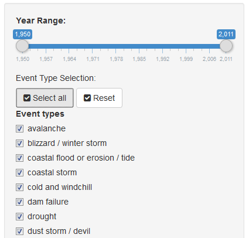
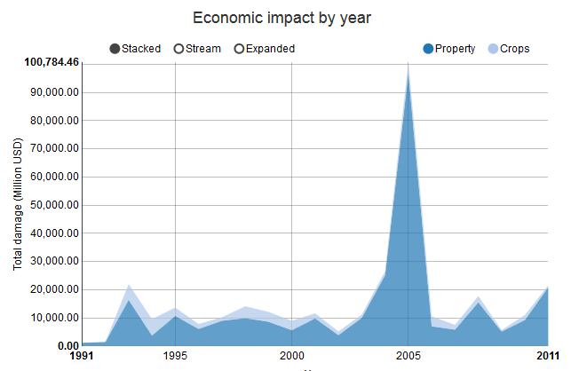
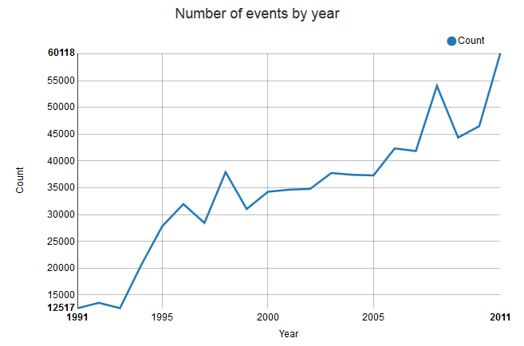

Economic Damage Impact by Weather Condition in the U.S.
========================================================
author: ZMustaqim
date: 22 Nov 2015
transition : rotate

Synopsis:
========================================================

This presentation is to highlight about my application whuch attempts to analyze data of natural events from the U.S.National Oceanic and Atmospheric Administration's (NOAA) storm database which had the impact from economy perspective. 

With storm database, data processing and analyzing done to see the impact trending and the result show in yearly trending.


Using the Application:
==========

In order to see yearly trend, input need to be set at first place:

- Yearly input via slider widget
- Event input via checkboxes



*** 

Dataset used:

```r
dt<-read.csv("data123.csv")
summary(dt)
```

```
      YEAR                 STATE      
 Min.   :1950   california    :  453  
 1st Qu.:1987   texas         :  421  
 Median :1999   pennsylvania  :  420  
 Mean   :1994   virginia      :  417  
 3rd Qu.:2005   north carolina:  416  
 Max.   :2011   florida       :  415  
                (Other)       :15072  
                              EVTYPE         COUNT        
 TORNADO                         :2682   Min.   :   1.00  
 THUNDERSTORM / THUNDERSTORM WIND:2677   1st Qu.:   4.00  
 HAIL                            :2555   Median :  12.00  
 WIND                            : 935   Mean   :  50.13  
 FLASH FLOOD                     : 905   3rd Qu.:  38.00  
 LIGHTNING                       : 895   Max.   :1794.00  
 (Other)                         :6965                    
   FATALITIES          INJURIES           PROPDMG        
 Min.   :  0.0000   Min.   :   0.000   Min.   :    0.00  
 1st Qu.:  0.0000   1st Qu.:   0.000   1st Qu.:    0.00  
 Median :  0.0000   Median :   0.000   Median :    0.01  
 Mean   :  0.8422   Mean   :   7.917   Mean   :   17.58  
 3rd Qu.:  0.0000   3rd Qu.:   1.000   3rd Qu.:    0.89  
 Max.   :626.0000   Max.   :6110.000   Max.   :31734.50  
                                                         
    CROPDMG        
 Min.   :   0.000  
 1st Qu.:   0.000  
 Median :   0.000  
 Mean   :   2.746  
 3rd Qu.:   0.000  
 Max.   :5000.050  
                   
```


Result of Application:
========================================================

Base on the input selection, we can see 2 yearly trending which are:

- Total Damage by year
 

***

- Total Event happen by year
 


Benefit
========================================================


With this application, user can simply identified the impact trending of the event by years. 

THANK YOU..
